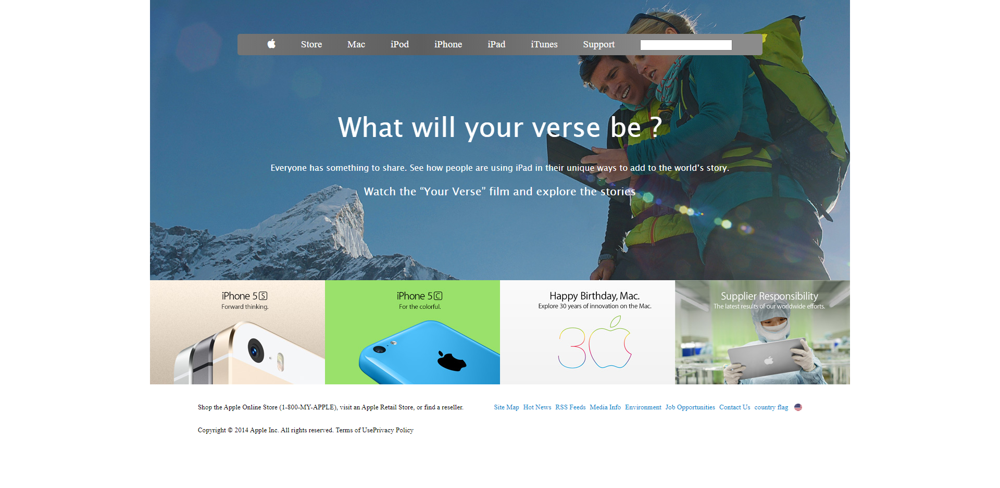

# apple-website-clone

# PROJECT: PROJECT: BUILDING WITH BACKGROUNDS AND GRADIENTS (Microverse Collaborative Project)

> This project consists on using of plain HTML and CSS to create a website.
> A reproduction of "apple" website was used to complete the project (https://web.archive.org/web/20140301004610/http://www.apple.com/)

#### Techniques used for positioning elements : 

flex
background images
gradient

## Built With

- HTML
- CSS

## Live Demo
- [Live Demo Link](https://raw.githack.com/Ahmed-Benj/apple-website-clone/tree/development)

#### Prerequisites
- Browser
- Internet

## Authors

👤 ** karthick harimoorthy **

- Github (https://github.com/karthykarthick)
- Linkedin (https://www.linkedin.com/in/karthick-harimoorthy/)

👤 **Ahmed Ben Jmii**

* Ahmed (https://github.com/Ahmed-Benj)
* Linkedin (https://www.linkedin.com/in/ahmed-b-05600992/)

## 🤝 Contributing

Contributions, issues and feature requests are welcome!

Feel free to check them https://github.com/Ahmed-Benj/apple-website-clone/issues.

## Show your support

Give a ⭐️ if you like this project!
